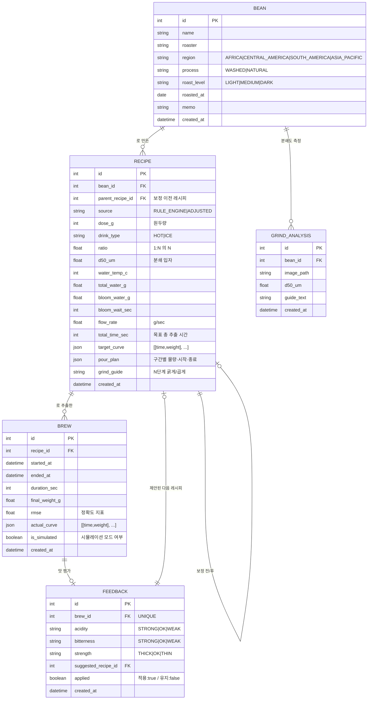

# 데이터 모델 (ERD)

졸업작품 **데모 범위** 기준입니다. SQLite + SQLAlchemy, 단일 사용자 가정(로그인·계정 테이블 없음).
곡선처럼 길이가 가변인 데이터는 정규화하지 않고 **JSON 컬럼**에 넣습니다. 데모에서는 곡선을 통째로 읽고 통째로 그리기만 하므로 시점별 행으로 쪼갤 이유가 없습니다.



## 설계 근거

- **RECIPE 자기참조(`parent_recipe_id`)** — Feedback Loop가 만든 보정 레시피를 새 행으로 쌓고 이전 레시피를 가리키게 합니다. 레시피를 덮어쓰지 않아야 "이전 vs 신규 곡선 겹쳐 보기"와 개선 이력 발표가 가능합니다.
- **RECIPE에 계산 결과를 전부 저장** — `water_temp_c`, `flow_rate`, `target_curve` 등은 Rule Engine이 만든 파생값이지만, 규칙 상수가 Phase 1 실측 후 바뀌어도 **과거 추출을 그대로 재현**할 수 있어야 하므로 저장합니다.
- **BREW ↔ FEEDBACK 1:1** — 추출 1건당 맛 평가 1건. `brew_id`에 UNIQUE.
- **`applied` 저장** — 사용자가 제안을 받아들였는지 여부가 나중에 개인화 모델의 학습 신호가 됩니다. 발표에서 "선택 결과를 축적하도록 설계했다"의 근거.
- **`is_simulated`** — 저울 없이 만든 기록과 실측을 구분해야 데모 데이터가 섞이지 않습니다.
- **GRIND_ANALYSIS는 P5** — Vision을 드랍해도 나머지 스키마에 영향이 없도록 분리했습니다.

## 데모 범위에서 뺀 것

| 항목 | 이유 |
|---|---|
| User / 로그인 | 단일 사용자 데모. 필요해지면 `user_id`를 각 테이블에 추가 |
| 곡선 시점별 테이블 | 행 수만 폭증하고 데모에서 쓸 쿼리가 없음 |
| 원두 재고·구매 이력 | 프로젝트 범위 밖 |
| 마이그레이션 도구(Alembic) | 초기엔 `create_all()`로 충분. 스키마가 안정되면 도입 검토 |

## ENUM 규칙

값은 **영어 대문자**로 저장하고, 한글 라벨은 프론트에서 매핑합니다.

```
region      AFRICA | CENTRAL_AMERICA | SOUTH_AMERICA | ASIA_PACIFIC
process     WASHED | NATURAL
roast_level LIGHT | MEDIUM | DARK
drink_type  HOT | ICE
taste       STRONG | OK | WEAK        (신맛·쓴맛)
strength    THICK | OK | THIN         (농도)
```
